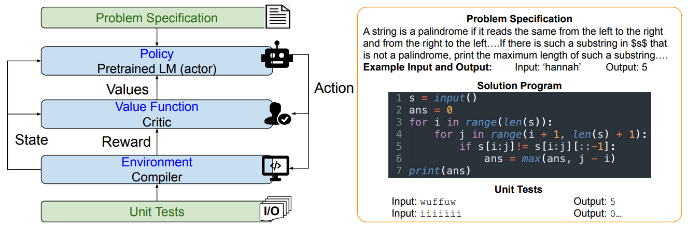
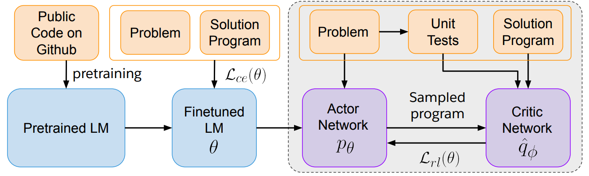
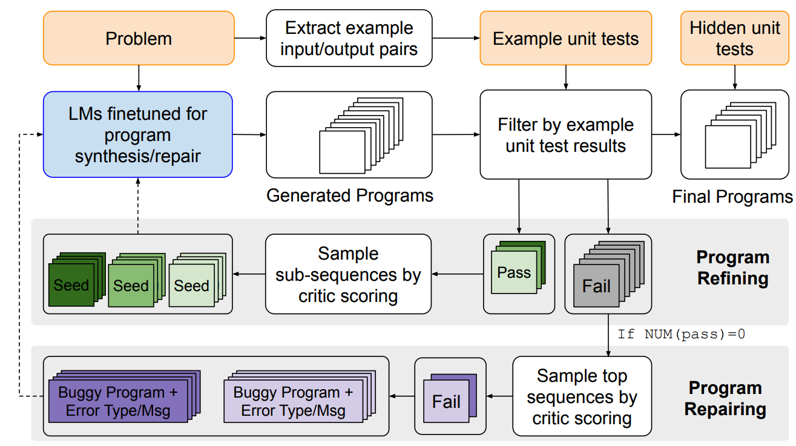
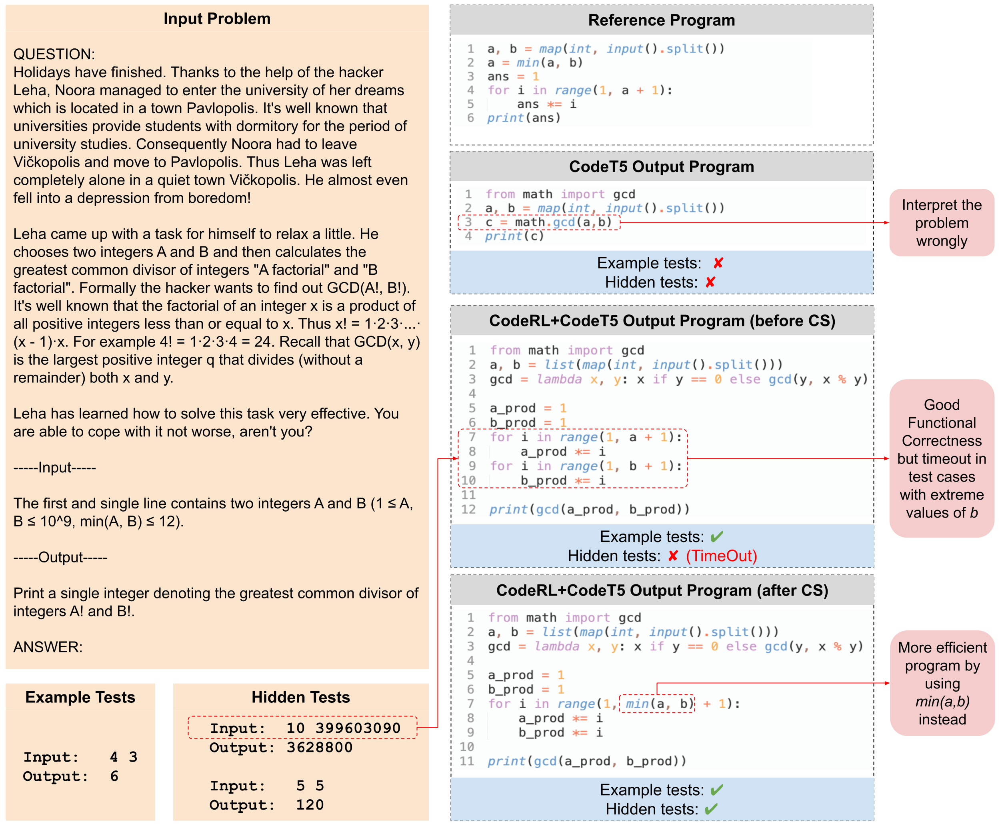

<p align="center">
  
</p>

## CodeRL: Mastering Code Generation through Pretrained Models and Deep Reinforcement Learning <a name="corl"></a>


This is the official code for the paper **[CodeRL: Mastering Code Generation through Pretrained Models and Deep Reinforcement Learning](https://arxiv.org/abs/2207.01780)** (accepted to [NeurIPS 2022](https://openreview.net/forum?id=WaGvb7OzySA)). Do check out our [blog](https://blog.salesforceairesearch.com/coderl/) and [poster](https://nips.cc/media/PosterPDFs/NeurIPS%202022/d98d76e2b5ba72023414d98e75403e79.png).

Authors:
[Hung Le](https://sites.google.com/view/henryle2018/home), [Yue Wang](https://yuewang-cuhk.github.io/), [Akhilesh Deepak Gotmare](https://akhileshgotmare.github.io/), [Silvio Savarese](https://scholar.google.com/citations?user=ImpbxLsAAAAJ&hl=en), [Steven C.H. Hoi](https://scholar.google.com/citations?user=JoLjflYAAAAJ&hl=en) 

<p align="center">

</p>

### Contents:
* [x] [CodeRL Overview](#coderl-overview)
* [x] [Installation](#installation)
* [x] [Datasets](#datasets)
	* [x] [Example Unit Tests](#example-unit-tests)
* [x] [Models](#models)
	* [x] CodeT5-large
	* [x] CodeT5-large-ntp-py
	* [x] CodeRL+CodeT5 
	* [x] Critic models 
* [ ] [Processes](#processes)  
	* [x] [Generating Programs](#generating-programs)
	* [x] [Running Unit Tests](#running-unit-tests)
	* [x] [Evaluating Programs](#evaluating-programs)
	* [x] [Training Critic](#training-critic)
	* [x] [Generating Critic Scores](#generating-critic-scores)
	* [x] [Finetuning with Ground-truth Programs](#finetuning-with-ground-truth-programs)
	* [x] [Finetuning with Generated Programs](#finetuning-with-generated-programs)
	* [ ] [Generating Programs with Critic Sampling](#generating-programs-with-critic-sampling)
* [x] [Example Generated Programs](#example-generated-programs)
* [x] [Citation](#citation)
* [x] [License](#license) 

## CodeRL Overview  


 <p align="center">

 <br>
<b>An example program synthesis task (Right)</b>: Each task includes a problem specification in natural language, which often contains example input and output pairs. The expected output is a program that is checked for functional correctness against some unit tests. 
<b>A high-level overview of our CodeRL framework for program synthesis (Left)</b>: Our CodeRL framework treats pretrained language model (LM) as a stochastic policy, token predictions as actions, and rewards can be estimated based on unit test results of output programs
</p>

* During training, we treat the code-generating language models as an actor network, and introduce a critic network that is trained to predict the functional correctness of generated programs and provide dense feedback signals to the actor. 
* During inference, we introduce a new generation procedure with a critical sampling strategy that allows a model to automatically regenerate programs based on feedback from example unit tests and critic scores. 


<!---
<p align="center">

<b>Overview of our actor-critic framework to optimize pretrained LMs for program
synthesis</b>: We treat the LM as an actor network and sample synthetic samples from this actor. Another neural network is trained as a critic model to evaluate these synthetic samples based on their probabilities of passing unit tests. The returns are estimated based on critic scores and finally factored into the RL objective to finetune the actor LM network using synthetic samples.
</p>

<p align="center">

<b>Overview of our Critic Sampling (CS) approach for program synthesis during inference</b>:
programs are refined and repaired based on their results on example unit tests of the corresponding problems. Program candidates are sampled by their critic-predicted scores at the token or sequence level. Dotted lines indicate optional processes that apply during program refining or repairing.
</p>
-->


## Installation  

The code requires some dependencies as specified in `requirements.txt`. Please follow the relevant libraries to install or run: 

`pip install -r requirements.txt`

Install the `transformers` library from the source code (the current source code is developed from the original [code](https://github.com/huggingface/transformers) of version 4.16.1): 

```
cd transformers
pip install -e .
```


## Datasets 

For pretraining, apart from the [CodeSearchNet (CSN)](https://arxiv.org/abs/1909.09436), we use the [Python Github Code Dataset (GCPY)](https://huggingface.co/datasets/lvwerra/github-code). 
We have compiled public, non-personal data from GitHub consisting of permissively licensed Python code (e.g. “mit”, “apache-2”, “bsd-3-clause”, “bsd-2- 126 clause”, “cc0-1.0”, “unlicense”, “isc”). Please see the paper for more details on pretraining data preprocessing and pretraining. 


After pretraining, we finetune/evaluate models on the following major program synthesis benchmarks: 

* **APPS**: Please follow the downloading and preprocessing instructions provided [here](https://github.com/hendrycks/apps). 
* **MBPP**: The dataset is available [here](https://github.com/google-research/google-research/tree/master/mbpp). 

On both benchmarks, we follow the same way of preprocessing data and constructing input/output sequences as the original benchmark papers. 

Download and unzip all files into the `data` folder.

### Example Unit Tests 
In addition to the original hidden unit tests on APPS, we also utilize the example tests that are often embedded in problem descriptions.
After downloading and unzipping APPS, you can run the notebook `extract_example_test.ipynb` to extract and save example unit tests of APPS test samples into corresponding sample folder e.g. `data/APPS/test/0000/`.
We release the example unit tests that we already extracted using this notebook in the folder `data/APPS_test_example_tests/`. The average number of example unit tests per sample is 1.9764.

## Models 

We employ [CodeT5](https://github.com/salesforce/CodeT5) (a family of encoder-decoder language models for code from the [paper](https://arxiv.org/pdf/2109.00859.pdf)) as the foundation model in our work. 

We pretrained CodeT5 with bigger dataset and improved learning objectives. We release two large-sized CodeT5 checkpoints at Hugging Face: [Salesforce/codet5-large](https://huggingface.co/Salesforce/codet5-large) and [Salesforce/codet5-large-ntp-py](https://huggingface.co/Salesforce/codet5-large-ntp-py).

* [CodeT5-large](https://huggingface.co/Salesforce/codet5-large): a 770M-CodeT5 model which was pretrained using Masked Span Prediction objective on CSN and achieved new SOTA results on several CodeXGLUE benchmarks. See Appendix A.1 of the [paper](https://arxiv.org/pdf/2207.01780.pdf) for more details.
* [CodeT5-large-ntp-py](https://huggingface.co/Salesforce/codet5-large-ntp-py): A 770M-CodeT5 model which was first pretrained using Masked Span Prediction objective on CSN and GCPY, followed by using Next Token Prediction objective on GCPY. _This checkpoint was especially optimized for Python code generation tasks and employed by CodeRL_.

For finetuning on downstream code generation tasks on APPS, we adopted critic models for RL training. We released the following critic model checkpoints (on Google Cloud Storage): 

* [CodeT5-finetuned_critic](https://console.cloud.google.com/storage/browser/sfr-coderl-research/codet5_finetuned_critic): a CodeT5 model which is initialized from a normal CodeT5-base and trained as a classifier to predict unit test outcomes (one of Compile Error, Runtime Error, Failed Tests, and Passed Tests). The critic is used to estimate returns and facilitate RL finetuning.
* [CodeT5-finetuned_critic_binary](https://console.cloud.google.com/storage/browser/sfr-coderl-research/codet5_finetuned_critic_binary): similar to the prior model but was trained with binary annotations (Passed Tests or not Passed Tests only). This critic is used to facilitate generation procedures during inference.

We released the following finetuned code generation model checkpoints (on Google Cloud Storage): 

* [CodeT5-finetuned_CodeRL](https://console.cloud.google.com/storage/browser/sfr-coderl-research/codet5_finetuned_codeRL): a CodeT5 model which was initialized from the prior pretrained CodeT5-large-ntp-py and then finetuned on APPS following our CodeRL training framework. 

Download all files into the `models` folder.

## Processes 

### Generating Programs 

We created `scripts/generate.sh` to generate programs on the APPS benchmark. You can directly run this file by configuring the following parameters: 

|   **Parameters**  |                                              **Description**                                             |       **Example Values**       |
|:-----------------:|:--------------------------------------------------------------------------------------------------------:|:------------------------------:|
| `model_path`        | Path to a trained CodeT5-style model                                                                     | models/codet5\_finetuned_codeRL |
| `tokenizer_path`    | Path to the saved tokenizer for CodeT5 (or path to cache the tokenizer)                                  | models/codet5_tokenizer/       |
| `test_path`         | Path to the original test samples                                                                        | data/APPS/test/                |
| `start`             | start index of test samples to be generated                                                              | 0                              |
| `end`               | end index of test samples to be generated                                                                | 5000                           |
|`num_seqs`          | number of total output programs to be generated (for sampling generation)                                | 1000                           |
| `num_seqs_per_iter` | Depending on the limit of GPU, we can generate multiple rounds, each with this number of output programs | 50                             |
| `temp`              | temperature for sampling generation                                                                      | 0.6                            |
| `output_path`              | Path to save generated programs                                                                      | outputs/codes/                            |

Other parameters are defined in the file `utils/generate_configs.py`.

Running the generation script will output programs, each of which is saved into a `json` file, including data fields `code` (list of output programs) and `prompt` (constructed input sequence to the LM model).


### Running Unit Tests 

Once the programs are generated, they are evaluated against the corresponding unseen unit tests in each problem. 

To execute the unit tests and obtain test outcomes, we adapt our code to the official implementation of the [APPS benchmark](https://github.com/hendrycks/apps/tree/main/eval). 

We created `scripts/run_unit_tests.sh` to run unit tests on generated programs on the APPS benchmark. You can directly run this file by configuring the following parameters:

| **Parameters** |                                                                                **Description**                                                                               |                  **Example Values**                 |
|:--------------:|:----------------------------------------------------------------------------------------------------------------------------------------------------------------------------:|:---------------------------------------------------:|
| `code_path`      | Path to the generated programs to be evaluated                                                                                                                               | outputs/codes/                                      |
| `output_path`    | Path to the save unit test results                                                                                                                                           | outputs/test_results/                               |
| `test_path`      | Path to the original test samples                                                                                                                                            | data/APPS/test/                                     |
| `example_tests`  | Whether to evaluate the programs on example unit tests (for filtering, refining programs) or hidden unit tests (for final evaluation)                                        | 0: use hidden unit tests; 1: use example unit tests |
| `start`          | start index of test samples to be evaluated                                                                                                                                  | 0                                                   |
| `end`            | end index of test samples to be evaluated                                                                                                                                    | 5000                                                |
| `threads`        | Depending on the capacity of the computation resource to run unit tests, we can run unit tests on multiple test samples over multiple threads to speed up the execution time | 30                                                  |


Running the script will output test results for each program. For each test sample, the results are saved into a `pickle` file, including data fields `results` (list of test outcomes, one of -2 = compile error, -1 = runtime error, False = failed test case, True = passed test case), `errors` (real compile error trace with details like error type and line numbers),  and `sols` (corresponding programs being evaluated).

Compared to the original implementation from APPS, we adopt one trick which will exit the unit testing loop if a program does not pass any test case. This will speed up the testing process while the final passing rate measures are not affected. Refer to the `run_test` function in `utils/testing_utils.py` for more details. 


### Evaluating Programs 
To compute the pass@k metrics, rather than using the APPS evaluation metrics, we follow the official implementation of the [HumanEval benchmark](https://github.com/openai/human-eval) (which better measures pass@k normalized by the number of possible k programs)


### Training Critic 

We can train a critic model as a classifier that predicts the test outcomes of generated samples. For each training sample, we can follow the prior processes ([generating programs](#generating-programs) and [running unit tests](#running-unit-tests)) to obtain synthetic samples and their annotations of unit test outcomes. On average, we generate 20 programs per training sample (we provided some example generated programs in `data/APPS/train/`).

Once the programs are tested, we can used their test outcomes as annotations to train a critic model initialized from a LM pretrained on source code data (we used CodeT5-based in this case). 

We created `scripts/train_critic.sh` and `scripts/train_critic_deepspeed.sh` to train a critic using generated programs. You can directly run this file by configuring the following parameters:

| **Parameters** |                                                                                **Description**                                                                               |                  **Example Values**                 |
|:--------------:|:----------------------------------------------------------------------------------------------------------------------------------------------------------------------------:|:---------------------------------------------------:|
| `batch-size-per-replica`      | Number of training samples per GPU device                                                                                                                               | 8                                      |
| `grad-acc-steps`    | Gradient accumulation steps                                                                                                                                            | 1                              |
| `epochs`      | Number of training epochs                                                                                                                                             | 10                                    |
| `lr`  | Learning rate                                        | 2e-5 |
| `save-freq`          | Save model checkpoints after this number of training steps                                                                                                                                 | 1000                                                  |
| `log-freq`            | Save model training losses after this number of training steps                                                                                                                                     | 10                                                |
| `save_total_limit`        | Total number of checkpoints to keep eventually (only the latest ones are kept) | 5                                                  |
| `fp16`        | Enable this to training model in 16-bit mode to reduce memory usage  | N/A                                                  |
| `deepspeed`        | If using deepspeed, set this parameter to the configuration file for deepspeed training  | configs/deepspeed_configs.json                                                  |
| `db`        | Enable this to train in debugging mode i.e. with small dummy data split and only 1 data worker  | N/A                                                  |

Other parameters are defined in the file `utils/train_configs.py`.

Running the script will train a critic model as a classifier that receives inputs as a problem description + a generated program and returns an output as one of 4 test outcomes: compile error, runtime error, failed tests, and passed tests. The model checkpoints are saved in a folder under `exps/`. 

### Generating Critic Scores

We created `scripts/generate_critic_scores.sh` to generate critic scores for synthetic programs. We use the same parameters as defined in [the generating program process](#generating-programs) with the following additional parameters:   

|   **Parameters**  |                                              **Description**                                             |       **Example Values**       |
|:-----------------:|:--------------------------------------------------------------------------------------------------------:|:------------------------------:|
| `critic_scores`        | Enable this to run inference on critic models and obtain critic scores                                                                    | N/A |
| `gt_solutions`    | Enable this to run inference on ground-truth programs; else, synthetic programs are used by default                                  | N/A      |
| `binary_prediction`    | Enable this to predict in binary classification i.e. passed tests or failed tests only                                  | N/A      |

Other parameters are defined in the file `utils/generate_configs.py`.

Running the generation script will output predictions of the critic model.
For each data sample, the prediction is saved into a `pkl` (pickle) file, including data fields `code` (list of programs), `prompt` (constructed input sequence to the critic model), `gt_error_type` (ground-truth test outcomes), `pred_error_type` (predicted test outcomes by critic), `error_hidden_states` (hidden states returned by critic). 

### Finetuning with Ground-truth Programs

We can finetune any pretraind language model as a program synthesis model that can generate code from problem description in natural language. In our approach, this stage of finetuning is a warmup stage using the ground-truth annotations (from APPS) before a further finetuning stage on synthetic/generated programs. 
 
We created `scripts/train_actor.sh` and `scripts/train_actor_deepspeed.sh` which include the parameters as defined above in the [critic training process](#training-critic). 

Running the script will finetune a pretrained CodeT5-large model that receives a problem description as input and returns a corresponding solution program in Python. 
The model checkpoints are saved in a folder under `exps/`. 

### Finetuning with Generated Programs

We created `scripts/train_actor_rl.sh` and `scripts/train_actor_rl_deepspeed.sh` to train pretrained LMs with synthetic generated programs. 
We use the parameters as defined above in the [critic training process](#training-critic) with the following additional parameters: 

|   **Parameters**  |                                              **Description**                                             |       **Example Values**       |
|:-----------------:|:--------------------------------------------------------------------------------------------------------:|:------------------------------:|
| `model_path`        | Path to a finetuned model checkpoint e.g. from warm-up training                                                                    | models/codet5_finetuned_codeRL |
| `relative_returns`    | Enable this to consider a baseline to compute relative return estimates rather than absolute return restimates in the RL loss| N/A      |

Other parameters are defined in the file `utils/train_configs.py`.


Running the script will load a finetuned CodeT5-large model and continue to train it with both generated programs as well as ground-truth programs in alternative training steps. 
The model checkpoints are saved in a folder under `exps/`. 

### Generating Programs with Critic Sampling 

We will release the implementation details of our critic sampling procedure. 

## Example Generated Programs 

<p align="center">

The problem is from the APPS benchmark, and the solution programs are generated by CodeT5 and CodeRL.
</p>

## Citation 

If you find the paper or the source code useful to your projects, please cite the following bibtex: 
<pre>
@inproceedings{
	le2022coderl,
	title={Code{RL}: Mastering Code Generation through Pretrained Models and Deep Reinforcement Learning},
	author={Hung Le and Yue Wang and Akhilesh Deepak Gotmare and Silvio Savarese and Steven Hoi},
	booktitle={Advances in Neural Information Processing Systems},
	editor={Alice H. Oh and Alekh Agarwal and Danielle Belgrave and Kyunghyun Cho},
	year={2022},
	url={https://openreview.net/forum?id=WaGvb7OzySA}
}
</pre>


## License 

The code is released under BSD 3-Clause - see `LICENSE.txt` for details.

This code is developed from other open source projects: including [APPS](https://github.com/hendrycks/apps/), [HumanEval](https://github.com/openai/human-eval), and [transformers](https://github.com/huggingface/transformers). We thank the original contributors of these works for open-sourcing their valuable source codes. 

